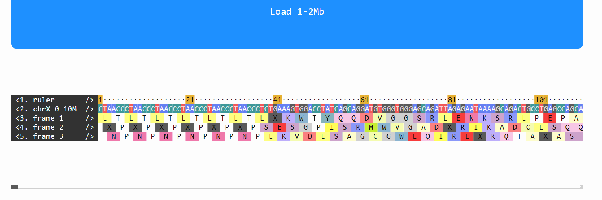
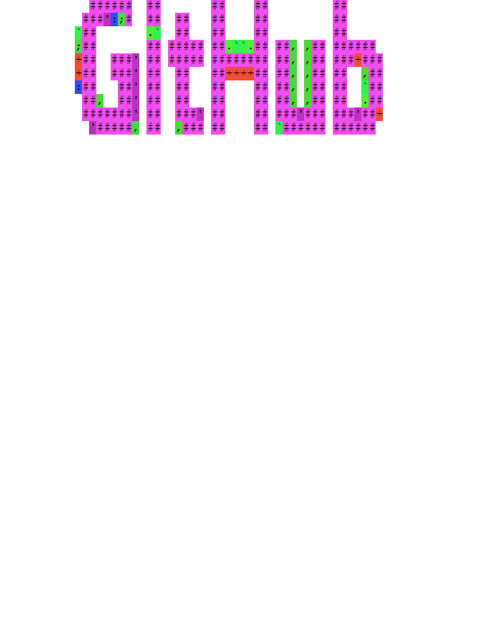
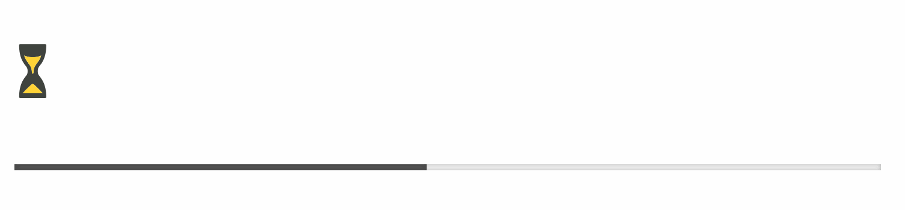

# LexiconMonoSeq

[](https://www.codacy.com/app/IbrahimTanyalcin/lexicon-mono-seq?utm_source=github.com&amp;utm_medium=referral&amp;utm_content=IbrahimTanyalcin/lexicon-mono-seq&amp;utm_campaign=Badge_Grade)
[](https://zenodo.org/badge/latestdoi/179171317)
[](https://joss.theoj.org/papers/9fbf126b501ad921825f755732450278)


*LexiconMonoSeq* is a multiple sequence alignment viewer ([MSA](https://en.wikipedia.org/wiki/Multiple_sequence_alignment)) that works with *monospace* fonts. You can use this tool for showing any arbitrary number of strings as well. The library renders DOM Text asynchronously.

## Disclaimer

Be careful when proving optional parameters `duration` and `durationPaint` for LexiconMonoSeq as low values (< 300ms) can elicit epileptic seizures to susceptible individuals. Follow the guidelines provided here: https://www.w3.org/TR/2008/REC-WCAG20-20081211/#seizure

## Dependencies

None.

## Tool's purpose

In truth this small script is a ascii animation framework that comes with performance baked in. It has its own cached easing functions and recycles batch of DOM elements to keep painting and rendering as short as possible. Possible use cases for:

- **Bioinformatics** : displaying long (even > 1Mb) sequences with frame-shifts. Aligning DNA/amino acids etc. 



- **Creative** : ascii glitch art etc.




## Usage
```JavaScript
LexiconMonoSeq(
    "#yourContainer",
    {parallelRendering:5}
).update([
    {
        name:"string1",
        charWidth:2, //OPTIONAL
        seq:"SOMETEXT",
        type:"alphabet",
        posOffset: 5 //OPTIONAL
    },
    {
        name:"string2",
        seq:"ATCG",
        type:"dna"
    }
]);
```

## Examples

### 1 Reading Clustal.wl Files


> #### [See script](https://github.com/IbrahimTanyalcin/lexicon-mono-seq/blob/master/examples/clustalW.html)
> #### [Run Example](https://distreau.com/lexicon-mono-seq/examples/clustalW.html)

You can read clustal.wl files if you provide them to *LexiconMonoSeq* as a string:

```JavaScript
instance.update(LexiconMonoSeq.readClustal(String))
```
### 2 ~10 Million Bases (0-1Mb/1-2Mb) of Chromosome X with 3 Possible Amino Acid Frameshifts


> #### [See script](https://github.com/IbrahimTanyalcin/lexicon-mono-seq/blob/master/examples/chrX10Mb.html)
> #### [Run Example](https://distreau.com/lexicon-mono-seq/examples/chrX10Mb.html)

Passing the optional `posOffset` shifts a given sequence to the right 1 unit char. This means if a sequence has `charWidth` of 10 and `posOffset` is 1, it is shifted 0.1 chars compared to its `charWidth`. This allows you to control track position of which you can't achive by adding spaces to the left. This property is useful if you are going to align DNA with amino acids or tracks with different `charWidth`.

The above example displays the first million bases of chromosomeX with 3 possible frames of amino acids.

### 3 1000 X 10000 Random Sequences


> #### [See script](https://github.com/IbrahimTanyalcin/lexicon-mono-seq/blob/master/examples/1000x10000RandomSeq.html)
> #### [Run Example](https://distreau.com/lexicon-mono-seq/examples/1000x10000RandomSeq.html)

*LexiconMonoSeq* comes with static (directly attached to the main function) methods that allows you to attach a *ruler* to your object, it finds the longest sequence and adds a ruler either to top of bottom of your dataset:

```JavaScript
let newDataset = LexiconMonoSeq.createRuler(oldDataset,true);
```

You can then use as you normally would:

```JavaScript
instance.update(obj,{durationPaint:500});
```
The second argument above are additional options which you can pass to *LexiconMonoSeq*.

### 4 Dynamic Updates of Sequences


> #### [See script](https://github.com/IbrahimTanyalcin/lexicon-mono-seq/blob/master/examples/dynamicUpdate.html)
> #### [Run Example](https://distreau.com/lexicon-mono-seq/examples/dynamicUpdate.html)

You do not have to instantiate a new version each time your object changes, you can repeteadly call <code>update</code> method to redraw sequences. Things to be removed/added/changed are arranged automatically.

### 5 First 10 Million Digits of PI to Letters


> #### [See script](https://github.com/IbrahimTanyalcin/lexicon-mono-seq/blob/master/examples/PI10Million.html)
> #### [Run Example](https://distreau.com/lexicon-mono-seq/examples/PI10Million.html)

If you ever need to get coordinates and data from *LexiconMonoSeq*, you can pass the evet to its <code>getInfoFromEvent</code> method:

```JavaScript
let info = instance.getInfoFromEvent(e);
```
Info looks like:

```JavaScript
{
    detail: "HIT", //pointer on valid target
    letter: "1", //character
    offset: 0.7847994668032854, //left offset in unit width
    pos: 42, //position in sequence
    rPos: 42, //position with respect to visible region
    state: "IDLE", //whether instance is in animation
    target: [Object], //sequence object
    trackNumber: 17 //vertical track number
}
```

You can also use the <code>getInfoFromRect</code> method to receive sequences from minimal bounding region of a given *DOM Rect* or *Object* with `top`,`left`,`width` and `height` properties supplied by the user.

### 6 Random Sequences + Random Smooth Scrolling


> #### [See script](https://github.com/IbrahimTanyalcin/lexicon-mono-seq/blob/master/examples/randomSequenceSmoothScroll.html)
> #### [Run Example](https://distreau.com/lexicon-mono-seq/examples/randomSequenceSmoothScroll.html)

You can automatically scroll to any horizontal/vertical position, for a dataset of 10000 letters length max and 1000 sequences:

```JavaScript
instance.scrollToPos(Math.random()*10000,Math.random()*1000)
```
Above would scroll to some random position along the map.

### 7 Animating Ascii Art


> #### [See script](https://github.com/IbrahimTanyalcin/lexicon-mono-seq/blob/master/examples/asciiAnimation.html)
> #### [Run Example](https://distreau.com/lexicon-mono-seq/examples/asciiAnimation.html)

You can always register new types using <code>registerType</code>:

```JavaScript
instance.registerType(
    "asciiArt",
    { //charater background colors
        " ":"#ffffff",
        "▄":"#22ee00",
        "▐":"#0022ee",
        "░":"#aa00aa",
        "▌":"#ee2200",
        "█":"#ee22ee",
        "▀":"#00ee22"
    },
    "rgba(0,0,0,0.9)" //textColor
);
```

### 8 Ascii Art Transitions


> #### [See script](https://github.com/IbrahimTanyalcin/lexicon-mono-seq/blob/master/examples/asciiAnimationGithub.html)
> #### [Run Example](https://distreau.com/lexicon-mono-seq/examples/asciiAnimationGithub.html)
> #### [Test @Observable](https://observablehq.com/@ibrahimtanyalcin/ascii-warp-github)

### 9 Reading Clustal With Conservation

You can also opt to show the conservation in Clustal WL files:

```JavaScript
LexiconMonoSeq.readClustal(
    "CLUSTAL W (1.82) multiple sequence alignment....",
    {conservation:true}
);
```

> #### [See script](https://github.com/IbrahimTanyalcin/lexicon-mono-seq/blob/master/examples/clustalW_2.html)
> #### [Run Example](https://distreau.com/lexicon-mono-seq/examples/clustalW_2.html)

### 10 Choosing color schemes

There are different color schemes you can choose from, the classic "aa" scheme is based on http://ugene.net/forum/YaBB.pl?num=1337064665, the jalview based schemes are taken from http://www.jalview.org/help/html/colourSchemes/index.html

```JavaScript
- aa //amino acid
- jalviewClustal 
- jalviewZappo
- jalviewTaylor
- jalviewHydrophobicity
- jalviewHelixPropensity
- jalviewStrandPropensity
- jalviewTurnPropensity
- jalviewBuriedIndex
- jalviewNucleotide
- jalviewPurinePyrimidine
- dna //DNA
- ruler //used in sequence numbering
- alphabet //generic letters
- number
```

You can always register new colors using `registerType` method:
```JavaScript
instance.registerType(
    "myType", //type name
    {"A":"#ffbbaa","B":"00aacc"...}, //colors for each letter box
    "rgba(0,0,0,0.9)", //color for text
    {"A":0.95, "B": 0.8...} //opacity for each letter box
);
```

> #### [See script](https://github.com/IbrahimTanyalcin/lexicon-mono-seq/blob/master/examples/colorSchemes.html)
> #### [Run Example](https://distreau.com/lexicon-mono-seq/examples/colorSchemes.html)

### 11 Fetching Data

LexiconMonoSeq has a built-in fetch mechanism which returns an async operator much like `Promises` in ES6:

```JavaScript
instance
.fetch("//someurl.com/lexicon-mono-seq/datasets/file.json","json")
.then(function(json){
    //do something with the json
    //example: this.update(json)
})
```
In certain situations you might have to call fetch in an already async operator, in that case to avoid too much callbacks, you can do:

```JavaScript
instance
.async(function(){
    var response = {value:null,done:false};
    setTimeout(function(){
        response.value = "//someurl.com/lexicon-mono-seq/datasets/file.json";
        response.done = true;
    },1000);
    return response;
}).then(function(retValue){
    var response = {value:null,done:false};
    this
    .fetch(retValue,"json")
    .then(function(json){
        response.value = json;
        response.done = true;
    });
    return response
}).then(function(retValue){
    //do something with the return value (retValue);
    //inside thenable, this refers to the instance
})
```

Since `fetch` returns an async thenable, you can always call `catch` method for catching errors.

> #### [See script](https://github.com/IbrahimTanyalcin/lexicon-mono-seq/blob/master/examples/asyncFetch.html)
> #### [Run Example](https://distreau.com/lexicon-mono-seq/examples/asyncFetch.html)

## Loading the script

*LexiconMonoSeq* supports [*UMD*](https://github.com/umdjs/umd). Use a derivate of the below link, based on the version you want:

`<script src="https://cdn.jsdelivr.net/gh/IbrahimTanyalcin/lexicon-mono-seq/lexiconMonoSeq.v0.16.0.js"></script>`

Above link can change if a new release is published. You can try adding the repo version (0.16.0 etc.):

`<script src="https://cdn.jsdelivr.net/gh/IbrahimTanyalcin/lexicon-mono-seq@[version]/lexiconMonoSeq.v[version].js"></script>`

For example:

> Npm

`<script src="https://cdn.jsdelivr.net/npm/lexicon-mono-seq@1.2.5/lexiconMonoSeq.v0.17.3.js"></script>`

> Github

`<script src="https://cdn.jsdelivr.net/gh/IbrahimTanyalcin/lexicon-mono-seq@0.16.0/lexiconMonoSeq.v0.16.0.js"></script>`

Alternatively you can requests all versions from here:

`<script src="https://distreau.com/lexicon-mono-seq/js/lexiconMonoSeq.v0.16.0.js"></script>`

Include the tag either within `body` or `head`, synchronous or asynchronous, according to your page's desing needs.

## A word about the fonts

> **Note:** As of version 0.18.0, I highly recommend using `isFontLoaded` method 

*LexiconMonoSeq* works with [monospace fonts](https://en.wikipedia.org/wiki/Monospaced_font) only, since fixed width characters are desired for proper alignment. Nonetheless, due to vender differences in font rendering, a few millipixel shift is normal.

You can use your custom monospace fonts, but make sure they are properly loaded before you create an instance. If the fonts are loaded later or you changed them, invoke the `reDraw` method of the instace to recalculate styles:

```JavaScript
instace.reDraw();
```

If you really wanna be on the safe side for both Mac and Windows, use *Courier New* font. 

If you load your custom fonts with `@import`, `@font-face` or `link` etc., give a small break after you create an instance, to allow browser calculations to kick-in. This time is possibly vendor dependent and usually a tick (~17ms) is sufficient. So instead of:

```JavaScript
LexiconMonoSeq("#test",{parallelRendering:5}).update(yourDataSet,{durationPaint:500,duration:500})
```
Do this:

```JavaScript
LexiconMonoSeq("#test",{parallelRendering:5}).skipFrames(30).then(function(){this.update(yourDataSet,{durationPaint:500,duration:500})}).then(...
```
Or even better:

```JavaScript
LexiconMonoSeq("#test",{parallelRendering:5}).isFontLoaded(200,2000).then(function(){this.update(yourDataSet,{durationPaint:500,duration:500})}).then(...
```

First one will skip 30 frames (considering 60 frames = 1 second) and then update, giving browser to correctly render the custom font.

Second one will wait until the font is loaded and then render. But if the loading takes more than 2000ms (2 seconds), it will return an error instead.

## Creating an instance

> LexiconMonoSeq ( *container_ID_String_Or_Node_Reference* [ , *options* ] )

Above implicity returns a new instance of LexiconMonoSeq. Options is an *Object* with several keys of which if don't exist, browser defaults are applied:

```JavaScript
{
    textRendering: String //CSS text-rendering value
    fontKerning: String //CSS font-kerning value
    webkitFontSmoothing: String //CSS -webkit-font-smoothing
    parallelRendering: Number //Number of sequences that can be rendered simultaneously
    ease: Object //2 element array of points with x,y coords like in CSS Cubic-bezier (http://cubic-bezier.com). For instance [{x:0.75,y:0},{x:0.25,y:1}] gives a slow-in-out effect.
    easeResolution: Number //Number of cached points along animation curve, default is 1000 and is sufficient for 60fps
    easePrecision: Number //A decimal float value that determines how mathematically close the calculated animation points are. Default is 1e-6, smaller is more exact.
    duration: Number //Number in milliseconds that controls sliding animation duration of new/updated/removing sequences, default is 1500
    easePaint: Object //Default is [{x:0.5,y:0.1},{x:0.75,y:0.9}] 
    durationPaint: Number //Number in milliseconds that controls the sliding of the colored background rectangles and text animation, default is 150
    labels: Boolean //Whether labels should be visible, default is true
}
```

## Registering new colors

You can always register new colors using `registerType` method:
```JavaScript
instance.registerType(
    "myType", //type name
    {"A":"#ffbbaa","B":"00aacc"...}, //colors for each letter box
    "rgba(0,0,0,0.9)", //color for text
    {"A":0.95, "B": 0.8...} //opacity for each letter box
);
```
The default jalview schemes comes with `"#ffffff"` for some letters, if you want to quickly generate a new scheme without having to call `registerType`,
you can do:

```JavaScript
instance.darkenColorScheme("jalviewClustal","#3e3e3e"); //returns "jalviewClustalDark"
```

For instance above, "jalviewClustal" is an in-built scheme, calling `darkenColorScheme` will create a new scheme "jalviewClustalDark" with `#ffffff` replaced with `"#3e3e3e"`. 
- If the second argument is a function it will instead invoke that function for every letter, passing the letter and its color as arguments. 
- The return value of above function will be new color for the darker scheme. 
- The new scheme name will be the former scheme name + "Dark". This string is returned by `darkenColorScheme`. Calling this method multiple times has no affect, it will return the scheme name without overwriting, to overwrite, pass an additional parameter:

```JavaScript
instance.darkenColorScheme(
    "jalviewClustal", //old scheme name
    function(k,v){ //replacer function
        if(k === "A" || k === "V"){
            return "#aaaaaa";
        } else {
            return v;
        }
    },
    true //overwrite even if dark scheme existed before
); //returns "jalviewClustalDark"
```
An example is [here](https://github.com/IbrahimTanyalcin/lexicon-mono-seq/blob/master/examples/colorSchemes.html);

## Async Operations

As of version 0.18.0 you can do async operations. There are 3 methods inherited by each instance which returns a *thenable* async object:

- `instance.fetch`
- `instance.skipFrames`
- `instance.async`

Each of them returns a thenable that can be chained:

```JavaScript
instance.async(function...).then(function...).skipFrames(50).then(function...).catch(function...)
```

Async operations do not require a polyfill and are written in ES5, they resemble much like promises. Each function inside a thenable is passed the return value of the other function. However there are some catches:

- If the return value inside a function is a primitive it is wrapped with an object of form `{value:your primitive,done:false}`. The next function in the chain grabs the value by accessing value, you do NOT have to extract it:

```JavaScript
instance
.async(function(){
    return 5;
}).then(function(x){
    console.log(x); //logs 5, not {value:5,done:true}
});
```

- If the return value is of the form `{value:..,done:..}`, then the next function will not execute until `done:true` is observed. This is called the **OBSERVER PATTERN**. If frames are skipped in between, they will not start decrementing until `done:true` is observed as well:

```JavaScript
instance
.async(function(){
    var response = {value:null,done:false};
    setTimeout(function(){
        response.value = 10;
        response.done = true;
    },1000);
    return response;
})
.skipFrames(120)
.then(function(retValue){
    console.log(retValue); //waits 1000ms, then waits 120 frames (~2000ms) and finally logs 10. 
});
```
As of version 0.19.0, async operations even get better, almost identical to how Promises work:

```JavaScript
instance.async(function(){
	return this.skipFrames(60).then(function(){return 5;});
}).then(function(x){
	return x+1; //6
});
```
OR

```JavaScript
instance.async(function(){
	return this.fetch("some url...","json");
}).then(function(json){
	return this.isFontLoaded(200).then(function(){return json;});
}).then(function(json){
	this.update(json);
});
```

This means that you can directly return an async operator inside an already async operator, and the next thenable will be assigned accordingly. You might already be familiar with this concept from the `Promises` ES6, if you still wish you can always revert to the observer pattern, whichever suits your style.

## Updating data

> instance.update ( *data* [ , *options* ] )

Data is an array of Object 's which each have at LEAST 3 properties:
- seq: a String of sequence like "ABCDEF.."
- name: a String that will be the name of the sequence such as "Sequence-1"
- type: a registered type, default types are "aa" (amino acid), "dna" (DNA), "ruler", "alphabet" and "number". You can register new types by using the <code>registerType</code> method.
- charWidth: **OPTIONAL**. Controls how wide the characters are, for instance a value of 5 means each char will be 5 characters wide.
- posOffset: **OPTIONAL**. Offsets the sequence row by n characters, even if your charWidth is 3 for instance, a posOffset of 1 would offset the row by 1/3 chars. This is useful for denoting [frameshifts](https://distreau.com/lexicon-mono-seq/examples/chrX10Mb.html).

Options are similar to [Creating an instance](#creating-an-instance), **EXCEPT** that the following **CANNOT** be used:

- textRendering
- fontKerning
- webkitFontSmoothing
- parallelRendering

When no options are given, previous options if any are used. A new option overrides the older ones.

## Reading Remote Clustal Files

Lexicon.readClustal reads a string, so first you need fetch it from the server:

```JavaScript
instance.async(function(){
    return this.fetch("someURL/clustal.txt");
}).then(function(text){
    this.update(
        LexiconMonoSeq.createRuler(
            LexiconMonoSeq.readClustal(text),
            true
        )
    );
});
```
This example reads about ~100Mb of Clustal file: https://distreau.com/lexicon-mono-seq/test/lexiconMonoSeq.html

Make sure that the remote host is returning `Access-Control-Allow-Origin` header with value of "*" so that you can access it.

## Reading JSON Files

Similarly like reading clustal files:

```JavaScript
instance.async(function(){
	return this.fetch("some url...","json");
}).then(function(json){
	this.update(json);
});
```

Here is a jsFiddle: https://jsfiddle.net/ibowankenobi/apjcxq1w/

Make sure that the remote host is returning `Access-Control-Allow-Origin` header with value of "*" so that you can access it.

## Static Methods

> LexiconMonoSeq.createRuler ( *data* , [ *inject* [, *unshift_or_push*]])

Crates a new object of type *ruler* and returns it if *inject* is false. Otherwise unshifts the new object into your data (mutates!) and returns the entire data. If *unshift_or_push* is set to true, then the object is added at the end of the array instead.

> LexiconMonoSeq.readClustal ( *clustalString* [ , *options* ] )

Reads a clustal file and returns a dataset to be used later with `update` method. Options is an *Object* that can have 2 properties, `charWidth` and `type`. Default `charWidth` is 1 and `type` is "aa".  

> LexiconMonoSeq.parseURL ( *url* )

Parses the given url and returns an object with various properties such as protocol, hash, path etc. Taken and adapted from https://j11y.io/javascript/parsing-urls-with-the-dom/ , many thanks to @padolsey (James Padolsey). Internally used by `fetch` method. 

## Methods

Below are a non-exhaustive list of methods that might be of use to the user.

- `instance.generateRandomString ()` *// generates mostly 7-8 digit hex number*
- `instance.registerType` ( *name* [ , *colors* [ , *textColor* [ , *opacities* ] ] ] ) *// adds new color palette*
- `instance.reDraw` ( ) *// re-calculates layout and renders data, use this if you changed the viewport size or the font-family*
- `instance.repaint` ( [, *force* ] ) *// requests a repaint without triggering layout calculations, if force is true, then it also forces rendering of tiles that do not need repaint. reDraw method internally calls this method but it additionally forces layout calculations. This method is lighter*
- `instance.detach` ( ) *// clears the last update Object from cache, loosing reference to it*
- `instance.toggleClass` ( *node* , *className* [ , *boolean* ] ) *// changes class of a node, it is chainable, when chaining you can omit the first parameter*
- `instance.getInfoFromEvent` ( *event* ) *// returns info from a pointer coordiante*
- `instance.garbage` ( ) *// removes itself from Parent Node, call this when you want to clear the instance. Make sure you do not have reference to it anywhere*
- `instance.getInfoFromRect` ( DOM Rect ) *// returns the minimal rectangle ofsequences that contain the given boundaries*
- `instance.scrollToPos` ( *horizontalPos* [ , *verticalPos* [, *options* ] ] ) *// options can have keys ease and duration. Default ease is [{x:0.75,y:0},{x:0.25,y:1}]*
- `instance.enableDrag` ( [ , options ] ) *// allows drag behavior, an options object can be passed with start, drag and end properties where each is a function to execute on dragStart, drag and dragEnd event. The functions have "this" point to the instance and have the current DOM event as the first argument. The second argument is the options Object itself*
- `instance.disableDrag` ( ) *// disables drag behavior*
- `instance.skipFrames` ( frameCount [, passthrough ) *//Returns an async operator. Waits for specified amount of frames before executing the following thenable. It returns an object with 3 properties `then`, `skipFrames` and `catch`. Function inside the thenable is executed with `this` pointing to the `instance` itself. There is an optional pass-through parameter to pass to the next *thenable*. `skipFrames` is usually used to delay update right after an instance is created, allowing CSS styles to kick in (Although I recommend using the `isFontLoaded` method!):*
```JavaScript
    LexiconMonoSeq("#test",{parallelRendering:5})
    .skipFrames(30)
    .then(function(){
        this.update(yourDataSet,{durationPaint:500,duration:500})
    }).then(function(){
        console.log(this)
    }).skipFrames(5)
    .then(function(){
        console.log("done!");
    })
 ```
 Above would first create an `instace`, wait half a second, then update with new data, then after 1 frame (~17ms) `console.log` the `instance` itself, wait another 5 frames and finaly log "done!".

 - `instance.fetch` ( url [, responseType ) *//Fetches the url and returns a thenable async operator. Default response type is "text", an optional parameter can be supplied for other responseTypes. The return value can be chained with `then`, `skipFrames` or `catch` methods*
 - `instance.async` ( passthrough ) *//Returns an async operator. An optional parameter can be supplied to be passed to the next `thenable`. If the passthrough is a function, its return value is used instead. If inside a `then` clause you return an error object or throw, the `catch` clause if any will be executed:*

```JavaScript
instance.then(function(){
    throw new Error("...");
    //or
    return new Error("...");
}).catch(function(e){
    console.log(e.message);
})
```

 - `instance.isFontLoaded` ( [, check interval, timeout  ] ) *//Returns an async operator that resolved if the font is loaded. It works by comparing browser's default fall back font compared to specified font. Default check interval is 170ms, you can specify an optional timeout to force return an error object and invoke catch instead.*


## Properties

Some non-exhaustive list of properties

- `instance.displayPadding` *// gets or sets the surplus residues rendered at the edges of the viewport. Default is 0.2, meaning if viewport is 100 letters wide, then 10 letters overflow on each side will be rendered*
- `instance.maxAllowedLabelLength` *// maximum label length in letters, overflowed part will be rendered in ellipsis (...)*
- `instance.painters` *// returns array of painter objects as determined by the parallelRendering option while instantiating LexiconMonoSeq*
- `painter.nodeLimit` *// each painter object has a default limit of 80 nodes to animate per duration. Remaining nodes will take turn*
- `instance._trackHeight` *//Gives the height of 1 sequence in pixels. Recalculated on reDraw*
- `instance._getMaxTrackLength` *//Returns an object with info about the longest sequence. Recalculated on reDraw*
- `instance._getMaxDisplayableChars` *//Returns the maximum displayable characters. Recalculated on reDraw*
- `instance._getMaxDisplayableSequences` *//Returns the max number of sequences that can be displayed. Recalculated on reDraw*
- `instance._dragEnabled` *//Returns true if drag behavior is enabled, otherwise returns a falsey value* 
- `instance._labels` *//Returns whether labels are enabled or not*

## Customizing CSS

The DOM hierachy looks like below:

> Container <-- div.LexiconMonoSeq.wrapper <-- div.LexiconMonoSeq.main <-- div.LexiconMonoSeq.sequence(s)..

Wrapper is the main element that fully extends to cover the container and gets vertical/horizontal scrollbars as necessary. This element is called the "viewport". 

When the script is first loaded a style object is appended to head with "data-name" attribute of "LexcionMonoSeqStyle". You can override these values by adding your custom style a "custom" class:

```CSS
div.LexiconMonoSeq.wrapper.custom {
    overflow: hidden;
}
```

## Extending LexiconMonoSeq

The inner constructor is not exposed, if you want to attach new methods directly attach it on the `LexiconMonoSeq`.

## Performance 

To give a clue about rendering performance, this library has been compared with a canvas based alternative, MSAViewer. Tests were performed on i7-2.7GHz-CPU/16GB-RAM/GeForce-GTX-950M with 64-bit OS.

| *max/min fps* | Chrome | Firefox 
 --- | --- | --- 
Lexicon-Mono-Seq | ~55 | 57/27
MSAViewer | ~30 | 53/13

The test html files and their respective profiles are located and indexed here: https://distreau.com/lexicon-mono-seq/test/

You can also live test them:

- https://jsfiddle.net/ibowankenobi/apjcxq1w/
- https://jsfiddle.net/ibowankenobi/s97g4vxa/

It is very important that the purpose of this comparison is not measure which approach (DOM vs canvas) is faster. Given the GPU advantage available probably pixel based rendering will always have an edge, however the purpose is to show that DOM based alternatives can have viable performance too.

## Remedies

In certain situations you might want to tweak your css a bit to overcome vendor related bugs.

- iOS automatic font zoom will distort the aligment as DOMText has to match properly on the background svg rectangles, to overcome this issue:

```Css
.LexiconMonoSeqContainer .LexiconMonoSeq.wrapper.custom {
	text-size-adjust: none;
	-webkit-text-size-adjust: none;
}
```

## TODO(s)

- Currently the `fontWidth` getter/setter returns live values from the `Range` object, which changes with `CSS transform`. This causes applet svgs to missalign when parent is transformed ( for instance, if parent is scaled by 0.5, svgs get scaled by 0.25 because `fontWidth` returns half the values ). One solution could be to add a new getter/setter that multiplies transformation matrix with its inverse.
- For very very tiny font sizes, we need to adjust font size dynamically for chrome or other browsers who similarly uses pixel rounding. For instance if a font size is specified as 8 and the bounding rect width for that is 4.46 pixels, we need to iteratively search for font sizes around 8 that yields a single decimal instead.

## Questions

You can contact me by opening an issue or twitter: **@ibrhmTanyalcin**


